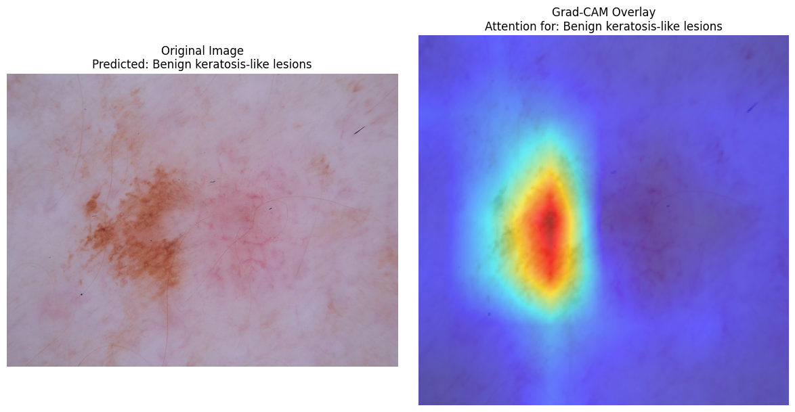
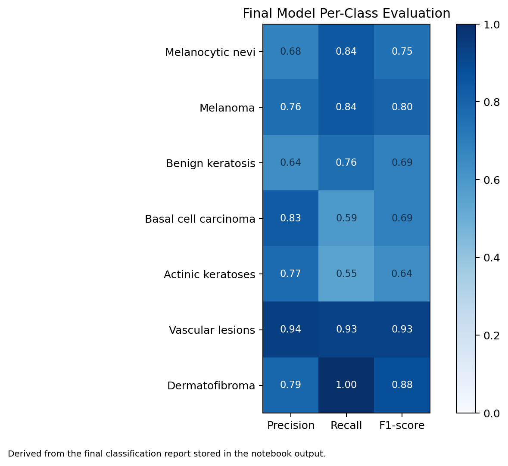

# Skin Lesion Classification with Generative AI Augmentation


Deep learning pipeline for skin lesion classification with generative data augmentation, improving accuracy from 82.97% to 86.03% using CLIP-filtered synthetic data.

## Overview

This project explores how generative augmentation can improve skin lesion classification when the dataset is heavily imbalanced. The pipeline trains an EfficientNet-B0 classifier, generates synthetic samples for minority lesion classes with Stable Diffusion, filters generated images with CLIP similarity, and evaluates the final model with classification metrics and Grad-CAM explainability.

## Problem

The HAM10000 dataset contains seven lesion categories, but the class distribution is highly imbalanced. Minority classes such as melanoma, basal cell carcinoma, and dermatofibroma have far fewer examples than the dominant classes. This makes a standard classifier more likely to favor majority classes and miss clinically important rare categories.

## Why This Matters

Accurate detection of rare skin conditions like melanoma is critical in medical diagnosis.

This project focuses on improving model performance for underrepresented classes, which are often the most clinically important.

## Approach

1. Fine-tuned an ImageNet-pretrained EfficientNet-B0 model for seven-class skin lesion classification.
2. Used focal loss, class weighting, weighted sampling, and image augmentations to reduce class-imbalance effects.
3. Generated synthetic dermoscopic images for minority classes using Stable Diffusion v1.5.
4. Filtered synthetic images with CLIP embeddings to keep samples semantically close to real class examples.
5. Re-trained the classifier on real plus CLIP-filtered synthetic data.
6. Added Grad-CAM visualizations to inspect which lesion regions influenced predictions.

Key innovation: instead of directly using synthetic data, CLIP-based filtering was applied to ensure only higher-quality samples were used, improving reliability.

## Results

Metrics are reported on the hold-out real test split.

| Metric | Improved Baseline | Augmented Model |
| :-- | --: | --: |
| Accuracy | 0.8297 | 0.8603 |
| F1-Macro | 0.7671 | 0.7697 |
| ROC-AUC (OVR) | 0.9615 | 0.9680 |

- Accuracy improved from 82.97% to 86.03%.
- ROC-AUC improved from 0.9615 to 0.9680.
- The pipeline specifically targets minority classes such as melanoma, basal cell carcinoma, and dermatofibroma.

## Visual Outputs

### Grad-CAM Example



### Model Evaluation Visual



## Tech Stack

- Python
- PyTorch and torchvision
- EfficientNet-B0
- Stable Diffusion via diffusers
- CLIP filtering
- scikit-learn
- Grad-CAM
- matplotlib and seaborn
- Weights & Biases

## Repository Structure

```text
skin-lesion-classification-augmentation/
|-- README.md
|-- requirements.txt
|-- skin_lesion_classification.ipynb
`-- outputs/
    |-- gradcam_example.png
    `-- confusion_matrix.png
```

## How to Run

1. Install dependencies:

```bash
pip install -r requirements.txt
```

2. Open the notebook:

```bash
jupyter notebook skin_lesion_classification.ipynb
```

3. Download the HAM10000 dataset from Kaggle when prompted by the notebook.
4. Run the notebook cells in order. GPU runtime is recommended for Stable Diffusion generation and model training.

## Key Takeaways

- CLIP filtering helped reduce noisy synthetic samples before re-training.
- Generative augmentation improved the final model's overall test-set performance.
- Grad-CAM provided a qualitative check that the model focuses on lesion-relevant regions.

## Limitations

- Synthetic medical images should not be treated as a substitute for expert-validated clinical data.
- Performance should be validated on additional external datasets before any real-world clinical use.
- Grad-CAM is useful for interpretability, but it does not fully explain model reasoning.
